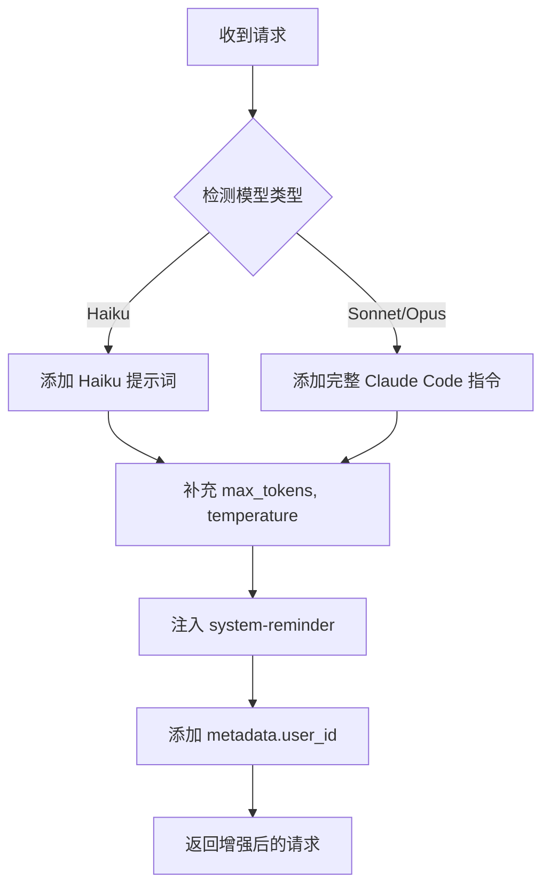
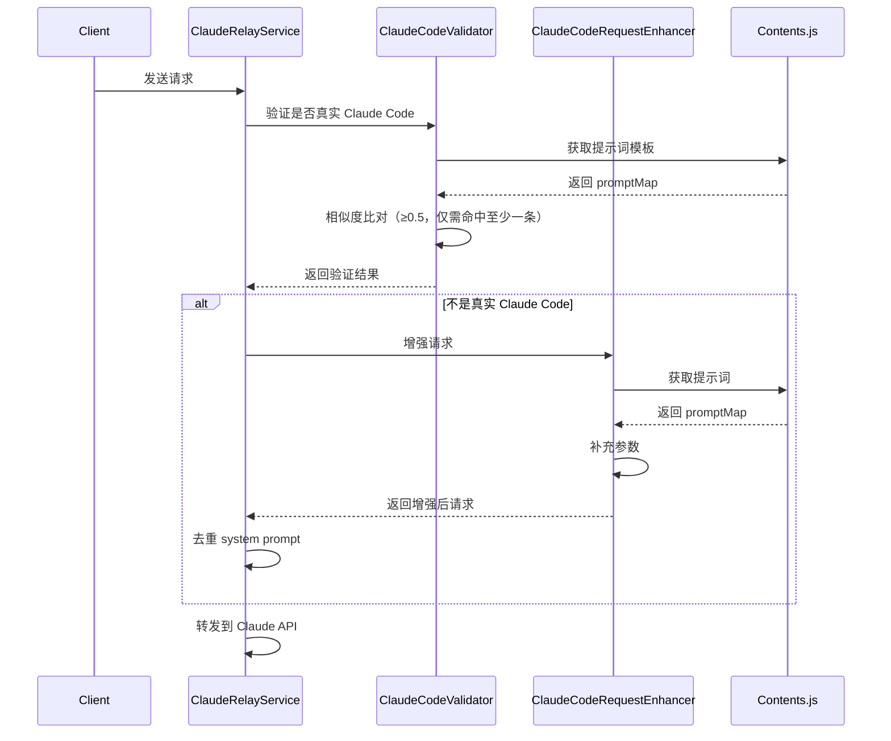
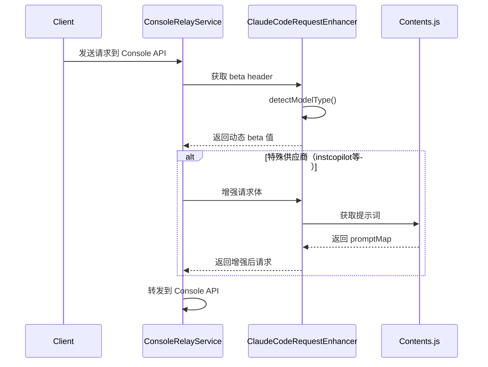

# Claude Code 请求增强器优化指南

> 本文档说明了 `claudeCodeRequestEnhancer.js` 与 `contents.js` 的关系及优化过程

## 📋 涉及的核心文件

```
src/
├── utils/
│   └── contents.js                          # Claude Code 官方提示词库（自动生成）
├── services/
│   ├── claudeCodeRequestEnhancer.js         # 请求增强器（已优化）✨
│   ├── claudeRelayService.js                # Claude 官方 API 转发服务
│   ├── claudeConsoleRelayService.js         # Claude Console API 转发服务
│   └── claudeConsoleAccountService.js       # Claude Console 账户管理（不涉及提示词）
└── validators/
    └── clients/claudeCodeValidator.js       # Claude Code 请求验证器
```

---

## 🎯 核心逻辑关系

### 1. **contents.js - 提示词源头**

**作用**：存储所有 Claude Code 官方提示词模板（从官方自动生成）

**关键导出**：
```javascript
module.exports = {
  promptMap,              // 提示词映射表
  bestSimilarityByTemplates,  // 字符串相似度比对（用于验证）
  SYSTEM_PROMPT_THRESHOLD     // 相似度阈值 0.5
}
```

**核心提示词分类**：

| 提示词 ID | 用途 | 使用场景 |
|-----------|------|----------|
| `haikuSystemPrompt` | Haiku 模型专用 | 对话标题提取 |
| `claudeOtherSystemPrompt1` | 基础身份标识 | "You are Claude Code..." |
| `claudeOtherSystemPrompt2` | 完整详细指令 | 包含 Tone、Task Management、Tool usage policy 等 |
| `claudeOtherSystemPrompt3` | Agent SDK 标识 | Agent SDK 场景（暂不使用） |
| `claudeOtherSystemPrompt4` | Agent SDK + Claude Code | Agent SDK 场景（暂不使用） |

---

### 2. **claudeCodeValidator.js - 请求验证器**

**作用**：验证请求是否来自真实的 Claude Code 客户端

**调用 contents.js 的方式**：
```javascript
const { bestSimilarityByTemplates, SYSTEM_PROMPT_THRESHOLD } = require('../../utils/contents')

let hasValidPrompt = false
const ignoredEntries = []

for (const entry of systemEntries) {
  const rawText = typeof entry?.text === 'string' ? entry.text : ''
  const { bestScore } = bestSimilarityByTemplates(rawText)

  if (bestScore >= SYSTEM_PROMPT_THRESHOLD) {
    hasValidPrompt = true
  } else if (rawText.trim()) {
    ignoredEntries.push({ score: bestScore })
  }
}

if (!hasValidPrompt) {
  return false  // 至少要匹配到一条官方 Claude Code 模板
}

// 其余未达标的 system prompt 只记调试日志，不会阻断
return true
```

**验证逻辑**：
1. User-Agent 匹配 `claude-cli/x.x.x`
2. System prompt 列表中至少有一条与官方模板相似度 ≥ 0.5（其余条目可低于阈值，仅记录调试日志）
3. 必需 headers：`x-app`, `anthropic-beta`, `anthropic-version`
4. `metadata.user_id` 格式：`user_{64位}_account__session_{uuid}`

---

### 3. **claudeCodeRequestEnhancer.js - 请求增强器**

**作用**：为非 Claude Code 请求补充必需参数，使其行为与真实 Claude Code 一致

**调用 contents.js 的方式**（优化后）：
```javascript
const { promptMap } = require('../utils/contents')

class ClaudeCodeRequestEnhancer {
  constructor() {
    // Haiku 模型提示词
    this.haikuDefaultSystem = [{
      type: 'text',
      text: promptMap.haikuSystemPrompt
    }]

    // Sonnet/Opus 基础标识
    this.claudeCodeSystemBase = {
      type: 'text',
      text: promptMap.claudeOtherSystemPrompt1  // "You are Claude Code..."
    }

    // 完整详细指令
    this.claudeCodeDetailedInstructions = {
      type: 'text',
      text: promptMap.claudeOtherSystemPrompt2  // 完整的行为规范
    }
  }
}
```

**增强流程**：



**关键方法**：

| 方法 | 作用 |
|------|------|
| `detectModelType(model)` | 检测模型类型（haiku/sonnet/opus） |
| `enhanceHaikuRequest()` | 为 Haiku 补充参数 |
| `enhanceSonnetOpusRequest()` | 为 Sonnet/Opus 补充完整指令 |
| `ensureClaudeCodeSystem()` | 确保包含 Claude Code system 参数 |
| `injectSystemReminders()` | 注入 system-reminder 消息 |
| `getBetaHeader(model)` | 根据模型获取正确的 anthropic-beta header |

---

### 4. **claudeConsoleRelayService.js - Claude Console API 转发服务**

**作用**：处理 Claude Console（claude.ai 网站）账户的 API 请求转发

**调用 contents.js/增强器的方式**：
```javascript
const claudeCodeRequestEnhancer = require('./claudeCodeRequestEnhancer')

// 1. 获取动态 beta header（根据模型类型）
const betaHeader = claudeCodeRequestEnhancer.getBetaHeader(modifiedRequestBody.model)

requestHeaders = {
  'anthropic-beta': betaHeader,  // haiku 或 sonnet/opus 的不同 beta 值
  // ... 其他 headers
}

// 2. 处理特殊供应商请求体（instcopilot、anyrouter 等）
_processSpecialVendorRequestBody(body) {
  // 使用增强器补充完整的 Claude Code 参数
  const enhancedBody = claudeCodeRequestEnhancer.enhanceRequest(body, {
    includeTools: false
  })
  return enhancedBody
}
```

**关键特性**：
- ✅ **智能 beta header**：根据模型自动选择正确的 `anthropic-beta` 值
- ✅ **特殊供应商支持**：为第三方供应商（如 instcopilot）补充标准参数
- ✅ **错误脱敏处理**：供应商错误（含中文）脱敏，Claude 官方错误透传

**使用场景**：
| 场景 | 调用方法 | 作用 |
|------|----------|------|
| 所有请求 | `getBetaHeader(model)` | 获取正确的 beta header |
| 特殊供应商 | `enhanceRequest(body)` | 补充完整 Claude Code 参数 |

---

### 5. **claudeRelayService.js - Claude 官方 API 转发服务**

**作用**：处理所有 API 请求转发

**调用增强器的流程**：
```javascript
_processRequestBody(body, clientHeaders, account) {
  // 1. 判断是否是真实的 Claude Code 请求
  const isRealClaudeCode = this.isRealClaudeCodeRequest(processedBody, clientHeaders)

  // 2. 如果不是，使用增强器补充参数
  if (!isRealClaudeCode) {
    processedBody = claudeCodeRequestEnhancer.enhanceRequest(processedBody, {
      includeTools: false
    })
  }

  // 3. 再次检查并去重 Claude Code 提示词（防止重复添加）
  if (!isRealClaudeCode) {
    // 去重逻辑：过滤掉已存在的 Claude Code 提示词
    const filteredSystem = processedBody.system.filter(
      (item) => !(item && item.text === this.claudeCodeSystemPrompt)
    )
    processedBody.system = [claudeCodePrompt, ...filteredSystem]
  }

  return processedBody
}
```

**重要特性**：
- ✅ **不会重复添加**：即使 `enhanceRequest` 和 `_processRequestBody` 都添加提示词，也有去重逻辑
- ✅ **安全保留现状**：两处处理都保留是安全的，建议不改动

---

## 🔧 优化前后对比

### 优化前（硬编码）

```javascript
// ❌ 提示词硬编码在代码中
this.claudeCodeSystemBase = {
  type: 'text',
  text: "You are Claude Code, Anthropic's official CLI for Claude."
}

// ❌ 只有简化版的指令
this.claudeCodeDetailedInstructions = {
  type: 'text',
  text: '\nYou are an interactive CLI tool that helps users with software engineering tasks...'
}
```

### 优化后（使用 contents.js）

```javascript
// ✅ 从官方提示词库获取
const { promptMap } = require('../utils/contents')

this.claudeCodeSystemBase = {
  type: 'text',
  text: promptMap.claudeOtherSystemPrompt1  // 官方标识
}

this.claudeCodeDetailedInstructions = {
  type: 'text',
  text: promptMap.claudeOtherSystemPrompt2  // 完整官方指令
}
```

**优化优势**：
1. ✅ **统一管理**：所有提示词来源于 `contents.js`
2. ✅ **官方一致**：使用官方 Claude Code 的完整指令（包含示例、Task Management 等）
3. ✅ **易于维护**：官方更新提示词时，只需更新 `contents.js`
4. ✅ **向后兼容**：预留了 Agent SDK 支持（`claudeOtherSystemPrompt3/4`）

---

## 📊 完整的请求处理流程

### 流程 A: Claude 官方 API（claudeRelayService）



### 流程 B: Claude Console API（claudeConsoleRelayService）



---

## 🚀 未来扩展建议

### 1. 支持 Agent SDK 场景（可选）

如果需要支持 Task 工具调用子 Agent，可以添加：

```javascript
// 检测是否是 Agent 请求
isAgentRequest(requestBody) {
  return requestBody.metadata?.agent_mode === true
}

// 使用 Agent SDK 提示词
if (this.isAgentRequest(requestBody)) {
  requestBody.system = [
    { text: promptMap.claudeOtherSystemPrompt4 }  // Agent SDK + Claude Code
  ]
}
```

### 2. 动态更新 contents.js（可选）

定期从官方 Claude Code 仓库同步最新提示词：

```bash
# 自动生成脚本
node scripts/sync-claude-code-prompts.js
```

---

## 📝 维护建议

1. **不要手动修改 `contents.js`**：这是自动生成的文件
2. **所有提示词逻辑都在 `claudeCodeRequestEnhancer.js` 中**
3. **如需调整行为，修改增强器而不是提示词内容**
4. **定期检查官方 Claude Code 是否有新的提示词模板**

---

## ❓ 常见问题

### Q1: 为什么不删除 `claudeRelayService.js` 中的重复处理？

**A**: 保留是安全的，因为：
- 有完善的去重逻辑（第506-509行）
- 作为双重保险，确保一定有 Claude Code 提示词
- 不会影响性能或功能

### Q2: `claudeOtherSystemPrompt3/4` 什么时候用？

**A**: 仅在 Agent SDK 场景使用：
- `prompt3`: 纯 Agent SDK 模式
- `prompt4`: Agent SDK 中的 Claude Code 模式
- 你的中转服务暂不需要

### Q3: `claudeConsoleRelayService` 和 `claudeRelayService` 有什么区别？

**A**: 两者处理不同来源的请求：

| 服务 | 处理对象 | 特点 |
|------|---------|------|
| `claudeRelayService` | Claude 官方 API 账户 | • 完整验证流程<br>• 去重 system prompt<br>• OAuth token 管理 |
| `claudeConsoleRelayService` | Claude Console 网站账户 | • 使用 API Key 直接调用<br>• 支持特殊供应商<br>• 智能错误脱敏 |

**共同点**：都使用 `claudeCodeRequestEnhancer` 获取正确的 beta header 和增强请求参数。

### Q4: 特殊供应商（instcopilot）什么时候会被增强？

**A**: 当检测到以下特征时：
- API URL 包含特殊供应商标识（如 `instcopilot.cn`）
- 请求缺少必需的 Claude Code 参数
- 此时会调用 `enhanceRequest()` 补充完整参数

### Q5: 如何验证优化是否生效？

**A**: 检查日志：
```
✅ Added complete Claude Code system parameters from contents.js
✅ Enhanced request with Claude Code parameters
🏷️ Enhanced request body for special vendor using claudeCodeRequestEnhancer
```

---

## 📌 快速参考

### 文件职责对照表

| 文件 | 职责 | 是否添加提示词 | 调用增强器 |
|------|------|----------------|-----------|
| `contents.js` | 提示词库（数据源） | ❌ | ❌ |
| `claudeCodeValidator.js` | 验证请求真实性 | ❌ | ❌ |
| `claudeCodeRequestEnhancer.js` | 增强非 Claude Code 请求 | ✅ | - |
| `claudeRelayService.js` | Claude 官方 API 转发 + 去重 | ✅ | ✅ |
| `claudeConsoleRelayService.js` | Claude Console API 转发 | ❌ | ✅ (部分) |
| `claudeConsoleAccountService.js` | 账户管理 | ❌ | ❌ |

### 增强器方法使用场景

| 方法 | 使用场景 | 调用位置 |
|------|----------|----------|
| `enhanceRequest(body, options)` | 补充完整 Claude Code 参数 | • claudeRelayService<br>• claudeConsoleRelayService（特殊供应商） |
| `getBetaHeader(model)` | 获取动态 beta header | • claudeRelayService<br>• claudeConsoleRelayService |
| `detectModelType(model)` | 检测模型类型 | 内部使用 |
| `ensureClaudeCodeSystem()` | 确保 system 参数正确 | 内部使用 |
| `injectSystemReminders()` | 注入 system-reminder | 内部使用 |

---

**文档版本**: v1.1
**最后更新**: 2025-01-07
**优化完成**: ✅ 所有提示词已统一使用 `contents.js`
**补充内容**: ✅ 新增 `claudeConsoleRelayService` 说明
