# Claude Code 请求增强器优化指南

> 本文档说明了 `claudeCodeRequestEnhancer.js` 与 `contents.js` 的关系及优化过程

## 📋 涉及的核心文件

```
src/
├── utils/
│   └── contents.js                          # Claude Code 官方提示词库（自动生成）
├── services/
│   ├── claudeCodeRequestEnhancer.js         # 请求增强器（已优化）✨
│   ├── claudeRelayService.js                # Claude 官方 API 转发服务
│   ├── claudeConsoleRelayService.js         # Claude Console API 转发服务
│   └── claudeConsoleAccountService.js       # Claude Console 账户管理（不涉及提示词）
└── validators/
    └── clients/claudeCodeValidator.js       # Claude Code 请求验证器
```

---

## 🎯 核心逻辑关系

### 1. **contents.js - 提示词源头**

**作用**：存储所有 Claude Code 官方提示词模板（从官方自动生成）

**关键导出**：

```javascript
module.exports = {
  promptMap, // 提示词映射表
  bestSimilarityByTemplates, // 字符串相似度比对（用于验证）
  SYSTEM_PROMPT_THRESHOLD // 相似度阈值 0.5
}
```

**核心提示词分类**：

| 提示词 ID                  | 用途                    | 使用场景                                         |
| -------------------------- | ----------------------- | ------------------------------------------------ |
| `haikuSystemPrompt`        | Haiku 模型专用          | 对话标题提取                                     |
| `claudeOtherSystemPrompt1` | 基础身份标识            | "You are Claude Code..."                         |
| `claudeOtherSystemPrompt2` | 完整详细指令            | 包含 Tone、Task Management、Tool usage policy 等 |
| `claudeOtherSystemPrompt3` | Agent SDK 标识          | Agent SDK 场景（暂不使用）                       |
| `claudeOtherSystemPrompt4` | Agent SDK + Claude Code | Agent SDK 场景（暂不使用）                       |

---

### 2. **claudeCodeValidator.js - 请求验证器**

**作用**：验证请求是否来自真实的 Claude Code 客户端

**调用 contents.js 的方式**：

```javascript
const { bestSimilarityByTemplates, SYSTEM_PROMPT_THRESHOLD } = require('../../utils/contents')

let hasValidPrompt = false
const ignoredEntries = []

for (const entry of systemEntries) {
  const rawText = typeof entry?.text === 'string' ? entry.text : ''
  const { bestScore } = bestSimilarityByTemplates(rawText)

  if (bestScore >= SYSTEM_PROMPT_THRESHOLD) {
    hasValidPrompt = true
  } else if (rawText.trim()) {
    ignoredEntries.push({ score: bestScore })
  }
}

if (!hasValidPrompt) {
  return false // 至少要匹配到一条官方 Claude Code 模板
}

// 其余未达标的 system prompt 只记调试日志，不会阻断
return true
```

**验证逻辑**：

1. User-Agent 匹配 `claude-cli/x.x.x`
2. System prompt 列表中至少有一条与官方模板相似度 ≥ 0.5（其余条目可低于阈值，仅记录调试日志）
3. 必需 headers：`x-app`, `anthropic-beta`, `anthropic-version`
4. `metadata.user_id` 格式：`user_{64位}_account__session_{uuid}`

---

### 3. **claudeCodeRequestEnhancer.js - 请求增强器**

**作用**：为非 Claude Code 请求补充必需参数，使其行为与真实 Claude Code 一致

**调用 contents.js 的方式**（优化后）：

```javascript
const { promptMap } = require('../utils/contents')

class ClaudeCodeRequestEnhancer {
  constructor() {
    // Haiku 模型提示词
    this.haikuDefaultSystem = [
      {
        type: 'text',
        text: promptMap.haikuSystemPrompt
      }
    ]

    // Sonnet/Opus 基础标识
    this.claudeCodeSystemBase = {
      type: 'text',
      text: promptMap.claudeOtherSystemPrompt1 // "You are Claude Code..."
    }

    // 完整详细指令
    this.claudeCodeDetailedInstructions = {
      type: 'text',
      text: promptMap.claudeOtherSystemPrompt2 // 完整的行为规范
    }
  }
}
```

**增强流程**：

```mermaid
graph TD
    A[收到请求] --> B{检测模型类型}
    B -->|Haiku| C[添加 Haiku 提示词]
    B -->|Sonnet/Opus| D[添加完整 Claude Code 指令]
    C --> E[补充 max_tokens, temperature]
    D --> E
    E --> F[注入 system-reminder]
    F --> G[添加 metadata.user_id]
    G --> H[返回增强后的请求]
```



**关键方法**：

| 方法                         | 作用                                     |
| ---------------------------- | ---------------------------------------- |
| `detectModelType(model)`     | 检测模型类型（haiku/sonnet/opus）        |
| `enhanceHaikuRequest()`      | 为 Haiku 补充参数                        |
| `enhanceSonnetOpusRequest()` | 为 Sonnet/Opus 补充完整指令              |
| `ensureClaudeCodeSystem()`   | 确保包含 Claude Code system 参数         |
| `injectSystemReminders()`    | 注入 system-reminder 消息                |
| `getBetaHeader(model)`       | 根据模型获取正确的 anthropic-beta header |

---

### 4. **claudeConsoleRelayService.js - Claude Console API 转发服务**

**作用**：处理 Claude Console（claude.ai 网站）账户的 API 请求转发

**调用 contents.js/增强器的方式**：

```javascript
const claudeCodeRequestEnhancer = require('./claudeCodeRequestEnhancer')

// 1. 获取动态 beta header（根据模型类型）
const betaHeader = claudeCodeRequestEnhancer.getBetaHeader(modifiedRequestBody.model)

requestHeaders = {
  'anthropic-beta': betaHeader,  // haiku 或 sonnet/opus 的不同 beta 值
  // ... 其他 headers
}

// 2. 处理特殊供应商请求体（instcopilot、anyrouter 等）
_processSpecialVendorRequestBody(body) {
  // 使用增强器补充完整的 Claude Code 参数
  const enhancedBody = claudeCodeRequestEnhancer.enhanceRequest(body, {
    includeTools: false
  })
  return enhancedBody
}
```

**关键特性**：

- ✅ **智能 beta header**：根据模型自动选择正确的 `anthropic-beta` 值
- ✅ **特殊供应商支持**：为第三方供应商（如 instcopilot）补充标准参数
- ✅ **错误脱敏处理**：供应商错误（含中文）脱敏，Claude 官方错误透传

**使用场景**：
| 场景 | 调用方法 | 作用 |
|------|----------|------|
| 所有请求 | `getBetaHeader(model)` | 获取正确的 beta header |
| 特殊供应商 | `enhanceRequest(body)` | 补充完整 Claude Code 参数 |

---

### 5. **claudeRelayService.js - Claude 官方 API 转发服务**

**作用**：处理所有 API 请求转发

**调用增强器的流程**：

```javascript
_processRequestBody(body, clientHeaders, account) {
  // 1. 判断是否是真实的 Claude Code 请求
  const isRealClaudeCode = this.isRealClaudeCodeRequest(processedBody, clientHeaders)

  // 2. 如果不是，使用增强器补充参数
  if (!isRealClaudeCode) {
    processedBody = claudeCodeRequestEnhancer.enhanceRequest(processedBody, {
      includeTools: false
    })
  }

  // 3. 再次检查并去重 Claude Code 提示词（防止重复添加）
  if (!isRealClaudeCode) {
    // 去重逻辑：过滤掉已存在的 Claude Code 提示词
    const filteredSystem = processedBody.system.filter(
      (item) => !(item && item.text === this.claudeCodeSystemPrompt)
    )
    processedBody.system = [claudeCodePrompt, ...filteredSystem]
  }

  return processedBody
}
```

**重要特性**：

- ✅ **不会重复添加**：即使 `enhanceRequest` 和 `_processRequestBody` 都添加提示词，也有去重逻辑
- ✅ **安全保留现状**：两处处理都保留是安全的，建议不改动

---

## 🔧 优化前后对比

### 优化前（硬编码）

```javascript
// ❌ 提示词硬编码在代码中
this.claudeCodeSystemBase = {
  type: 'text',
  text: "You are Claude Code, Anthropic's official CLI for Claude."
}

// ❌ 只有简化版的指令
this.claudeCodeDetailedInstructions = {
  type: 'text',
  text: '\nYou are an interactive CLI tool that helps users with software engineering tasks...'
}
```

### 优化后（使用 contents.js）

```javascript
// ✅ 从官方提示词库获取
const { promptMap } = require('../utils/contents')

this.claudeCodeSystemBase = {
  type: 'text',
  text: promptMap.claudeOtherSystemPrompt1 // 官方标识
}

this.claudeCodeDetailedInstructions = {
  type: 'text',
  text: promptMap.claudeOtherSystemPrompt2 // 完整官方指令
}
```

**优化优势**：

1. ✅ **统一管理**：所有提示词来源于 `contents.js`
2. ✅ **官方一致**：使用官方 Claude Code 的完整指令（包含示例、Task Management 等）
3. ✅ **易于维护**：官方更新提示词时，只需更新 `contents.js`
4. ✅ **向后兼容**：预留了 Agent SDK 支持（`claudeOtherSystemPrompt3/4`）

---

## 📊 完整的请求处理流程

### 流程 A: Claude 官方 API（claudeRelayService）

```mermaid
sequenceDiagram
    participant Client
    participant ClaudeRelayService
    participant ClaudeCodeValidator
    participant ClaudeCodeRequestEnhancer
    participant Contents.js

    Client->>ClaudeRelayService: 发送请求
    ClaudeRelayService->>ClaudeCodeValidator: 验证是否真实 Claude Code
    ClaudeCodeValidator->>Contents.js: 获取提示词模板
    Contents.js-->>ClaudeCodeValidator: 返回 promptMap
    ClaudeCodeValidator->>ClaudeCodeValidator: 相似度比对（≥0.5，仅需命中至少一条）
    ClaudeCodeValidator-->>ClaudeRelayService: 返回验证结果

    alt 不是真实 Claude Code
        ClaudeRelayService->>ClaudeCodeRequestEnhancer: 增强请求
        ClaudeCodeRequestEnhancer->>Contents.js: 获取提示词
        Contents.js-->>ClaudeCodeRequestEnhancer: 返回 promptMap
        ClaudeCodeRequestEnhancer->>ClaudeCodeRequestEnhancer: 补充参数
        ClaudeCodeRequestEnhancer-->>ClaudeRelayService: 返回增强后请求
        ClaudeRelayService->>ClaudeRelayService: 去重 system prompt
    end

    ClaudeRelayService->>ClaudeRelayService: 转发到 Claude API
```



### 流程 B: Claude Console API（claudeConsoleRelayService）

```mermaid
sequenceDiagram
    participant Client
    participant ConsoleRelayService
    participant ClaudeCodeRequestEnhancer
    participant Contents.js

    Client->>ConsoleRelayService: 发送请求到 Console API

    ConsoleRelayService->>ClaudeCodeRequestEnhancer: 获取 beta header
    ClaudeCodeRequestEnhancer->>ClaudeCodeRequestEnhancer: detectModelType()
    ClaudeCodeRequestEnhancer-->>ConsoleRelayService: 返回动态 beta 值

    alt 特殊供应商（instcopilot等）
        ConsoleRelayService->>ClaudeCodeRequestEnhancer: 增强请求体
        ClaudeCodeRequestEnhancer->>Contents.js: 获取提示词
        Contents.js-->>ClaudeCodeRequestEnhancer: 返回 promptMap
        ClaudeCodeRequestEnhancer-->>ConsoleRelayService: 返回增强后请求
    end

    ConsoleRelayService->>ConsoleRelayService: 转发到 Console API
```



---

## 🚀 未来扩展建议

### 1. 支持 Agent SDK 场景（可选）

如果需要支持 Task 工具调用子 Agent，可以添加：

```javascript
// 检测是否是 Agent 请求
isAgentRequest(requestBody) {
  return requestBody.metadata?.agent_mode === true
}

// 使用 Agent SDK 提示词
if (this.isAgentRequest(requestBody)) {
  requestBody.system = [
    { text: promptMap.claudeOtherSystemPrompt4 }  // Agent SDK + Claude Code
  ]
}
```

### 2. 动态更新 contents.js（可选）

定期从官方 Claude Code 仓库同步最新提示词：

```bash
# 自动生成脚本
node scripts/sync-claude-code-prompts.js
```

---

## 📝 维护建议

1. **不要手动修改 `contents.js`**：这是自动生成的文件
2. **所有提示词逻辑都在 `claudeCodeRequestEnhancer.js` 中**
3. **如需调整行为，修改增强器而不是提示词内容**
4. **定期检查官方 Claude Code 是否有新的提示词模板**

---

## ❓ 常见问题

### Q1: 为什么不删除 `claudeRelayService.js` 中的重复处理？

**A**: 保留是安全的，因为：

- 有完善的去重逻辑（第506-509行）
- 作为双重保险，确保一定有 Claude Code 提示词
- 不会影响性能或功能

### Q2: `claudeOtherSystemPrompt3/4` 什么时候用？

**A**: 仅在 Agent SDK 场景使用：

- `prompt3`: 纯 Agent SDK 模式
- `prompt4`: Agent SDK 中的 Claude Code 模式
- 你的中转服务暂不需要

### Q3: `claudeConsoleRelayService` 和 `claudeRelayService` 有什么区别？

**A**: 两者处理不同来源的请求：

| 服务                        | 处理对象                | 特点                                                          |
| --------------------------- | ----------------------- | ------------------------------------------------------------- |
| `claudeRelayService`        | Claude 官方 API 账户    | • 完整验证流程<br>• 去重 system prompt<br>• OAuth token 管理  |
| `claudeConsoleRelayService` | Claude Console 网站账户 | • 使用 API Key 直接调用<br>• 支持特殊供应商<br>• 智能错误脱敏 |

**共同点**：都使用 `claudeCodeRequestEnhancer` 获取正确的 beta header 和增强请求参数。

### Q4: 特殊供应商（instcopilot）什么时候会被增强？

**A**: 当检测到以下特征时：

- API URL 包含特殊供应商标识（如 `instcopilot.cn`）
- 请求缺少必需的 Claude Code 参数
- 此时会调用 `enhanceRequest()` 补充完整参数

### Q5: 如何验证优化是否生效？

**A**: 检查日志：

```
✅ Added complete Claude Code system parameters from contents.js
✅ Enhanced request with Claude Code parameters
🏷️ Enhanced request body for special vendor using claudeCodeRequestEnhancer
```

---

## 📌 快速参考

### 文件职责对照表

| 文件                             | 职责                        | 是否添加提示词 | 调用增强器 |
| -------------------------------- | --------------------------- | -------------- | ---------- |
| `contents.js`                    | 提示词库（数据源）          | ❌             | ❌         |
| `claudeCodeValidator.js`         | 验证请求真实性              | ❌             | ❌         |
| `claudeCodeRequestEnhancer.js`   | 增强非 Claude Code 请求     | ✅             | -          |
| `claudeRelayService.js`          | Claude 官方 API 转发 + 去重 | ✅             | ✅         |
| `claudeConsoleRelayService.js`   | Claude Console API 转发     | ❌             | ✅ (部分)  |
| `claudeConsoleAccountService.js` | 账户管理                    | ❌             | ❌         |

### 增强器方法使用场景

| 方法                            | 使用场景                  | 调用位置                                                          |
| ------------------------------- | ------------------------- | ----------------------------------------------------------------- |
| `enhanceRequest(body, options)` | 补充完整 Claude Code 参数 | • claudeRelayService<br>• claudeConsoleRelayService（特殊供应商） |
| `getBetaHeader(model)`          | 获取动态 beta header      | • claudeRelayService<br>• claudeConsoleRelayService               |
| `detectModelType(model)`        | 检测模型类型              | 内部使用                                                          |
| `ensureClaudeCodeSystem()`      | 确保 system 参数正确      | 内部使用                                                          |
| `injectSystemReminders()`       | 注入 system-reminder      | 内部使用                                                          |

---

## 🔐 Claude Code 统一请求头配置

### 背景说明

为了确保所有从 Claude Relay Service 转发到上游 API 的请求具有一致性，避免被上游检测为多账号异常行为，我们实现了**固定请求头**策略。

### 核心配置文件

**`src/services/claudeCodeRequestEnhancer.js`**

```javascript
class ClaudeCodeRequestEnhancer {
  constructor() {
    // 📌 固定的 Claude Code 请求头配置（统一所有请求）
    this.fixedClaudeCodeHeaders = {
      'User-Agent': 'claude-cli/4.14.0', // 🔧 更新此版本号
      'anthropic-version': '2023-06-01',
      'x-app': 'claude-code',
      priority: 'u=1, i',
      'sec-ch-ua': '"Chromium";v="132", "Not-A.Brand";v="24", "Google Chrome";v="132"',
      'sec-ch-ua-mobile': '?0',
      'sec-ch-ua-platform': '"Windows"',
      'sec-fetch-dest': 'empty',
      'sec-fetch-mode': 'cors',
      'sec-fetch-site': 'none'
    }
  }

  // 📌 获取统一的 Claude Code 请求头
  getFixedHeaders() {
    return { ...this.fixedClaudeCodeHeaders }
  }
}
```

### 使用场景

**所有 Claude API 转发服务都应使用此统一请求头**：

| 服务文件                       | 应用位置                | 调用方法                                      |
| ------------------------------ | ----------------------- | --------------------------------------------- |
| `claudeRelayService.js`        | Claude 官方 API 转发    | `claudeCodeRequestEnhancer.getFixedHeaders()` |
| `claudeConsoleRelayService.js` | Claude Console API 转发 | `claudeCodeRequestEnhancer.getFixedHeaders()` |
| `bedrockRelayService.js`       | AWS Bedrock 转发        | 不适用（AWS 签名机制不同）                    |
| `ccrRelayService.js`           | CCR 转发                | `claudeCodeRequestEnhancer.getFixedHeaders()` |

### 代码实现示例

#### claudeRelayService.js

```javascript
const claudeCodeRequestEnhancer = require('./claudeCodeRequestEnhancer')

async relayRequest(requestBody, account, clientHeaders) {
  // 1. 获取统一的固定请求头
  const fixedHeaders = claudeCodeRequestEnhancer.getFixedHeaders()

  // 2. 合并账户 token 和动态 beta header
  const requestHeaders = {
    ...fixedHeaders, // 🔧 固定请求头（优先级最高）
    'anthropic-beta': betaHeader, // 动态 beta（根据模型决定）
    Authorization: `Bearer ${accessToken}`, // 账户凭据
  }

  // 3. 转发请求
  const response = await axios.post(API_URL, requestBody, {
    headers: requestHeaders,
    // ...
  })
}
```

#### claudeConsoleRelayService.js

```javascript
const claudeCodeRequestEnhancer = require('./claudeCodeRequestEnhancer')

async relayRequest(requestBody, account, clientHeaders) {
  // 1. 获取统一的固定请求头
  const fixedHeaders = claudeCodeRequestEnhancer.getFixedHeaders()

  // 2. 合并账户 API Key 和动态 beta header
  const requestHeaders = {
    ...fixedHeaders, // 🔧 固定请求头
    'anthropic-beta': betaHeader,
    'x-api-key': apiKey, // Console 账户使用 API Key
  }

  // 3. 转发请求
  const response = await axios.post(API_URL, requestBody, {
    headers: requestHeaders,
    // ...
  })
}
```

### 更新指南

#### ⚠️ 当需要更新某些请求头参数时

**步骤 1: 修改 `claudeCodeRequestEnhancer.js`**

打开文件：`src/services/claudeCodeRequestEnhancer.js`

定位到 `constructor()` 中的 `fixedClaudeCodeHeaders` 配置块：

```javascript
this.fixedClaudeCodeHeaders = {
  'User-Agent': 'claude-cli/4.14.0', // 🔧 修改版本号
  'anthropic-version': '2023-06-01' // 🔧 更新 API 版本
  // ... 其他参数
}
```

**步骤 2: 运行格式化工具**

```bash
npx prettier --write src/services/claudeCodeRequestEnhancer.js
```

**步骤 3: 重启服务**

```bash
npm run service:restart
```

**步骤 4: 验证更新**

查看日志确认新的请求头已生效：

```bash
npm run service:logs:follow
```

检查日志中是否包含：

```
✅ Using fixed Claude Code headers (User-Agent: claude-cli/4.14.0)
```

#### 🔧 常见更新场景

| 更新内容          | 修改位置             | 示例                  |
| ----------------- | -------------------- | --------------------- |
| Claude CLI 版本号 | `User-Agent`         | `claude-cli/4.15.0`   |
| API 版本          | `anthropic-version`  | `2024-01-01`          |
| 浏览器版本        | `sec-ch-ua`          | `"Chromium";v="133"`  |
| 操作系统          | `sec-ch-ua-platform` | `"macOS"` / `"Linux"` |

#### 📋 完整的固定请求头参数说明

| 参数名               | 当前值              | 作用                   | 是否可修改                      |
| -------------------- | ------------------- | ---------------------- | ------------------------------- |
| `User-Agent`         | `claude-cli/4.14.0` | Claude Code 客户端标识 | ✅ 需同步官方版本               |
| `anthropic-version`  | `2023-06-01`        | Anthropic API 版本     | ✅ 跟随官方更新                 |
| `x-app`              | `claude-code`       | 应用标识               | ⚠️ 不建议修改                   |
| `priority`           | `u=1, i`            | HTTP/2 优先级          | ⚠️ 保持不变                     |
| `sec-ch-ua`          | Chromium 信息       | 浏览器标识             | ✅ 可更新版本号                 |
| `sec-ch-ua-mobile`   | `?0`                | 非移动设备             | ⚠️ 保持不变                     |
| `sec-ch-ua-platform` | `"Windows"`         | 操作系统               | ✅ 可改为 `"macOS"` / `"Linux"` |
| `sec-fetch-dest`     | `empty`             | Fetch 目标类型         | ⚠️ 保持不变                     |
| `sec-fetch-mode`     | `cors`              | Fetch 模式             | ⚠️ 保持不变                     |
| `sec-fetch-site`     | `none`              | Fetch 站点             | ⚠️ 保持不变                     |

#### ⚠️ 重要提醒

1. **不要在各个转发服务中单独设置这些固定请求头**
   - ❌ 错误做法：在 `claudeRelayService.js` 中直接写死 `User-Agent`
   - ✅ 正确做法：统一调用 `claudeCodeRequestEnhancer.getFixedHeaders()`

2. **动态参数不应放在固定请求头中**
   - `anthropic-beta`: 根据模型动态生成（使用 `getBetaHeader(model)`）
   - `Authorization` / `x-api-key`: 根据账户类型动态添加

3. **格式化代码**
   - 修改后必须运行 `npx prettier --write` 确保代码风格一致

4. **测试验证**
   - 更新后务必查看日志，确认新的请求头已应用到实际请求中

---

**文档版本**: v1.2
**最后更新**: 2025-01-21
**优化完成**: ✅ 所有提示词已统一使用 `contents.js`
**补充内容**:

- ✅ 新增 `claudeConsoleRelayService` 说明
- ✅ 新增 **Claude Code 统一请求头配置** 章节（v1.2）
