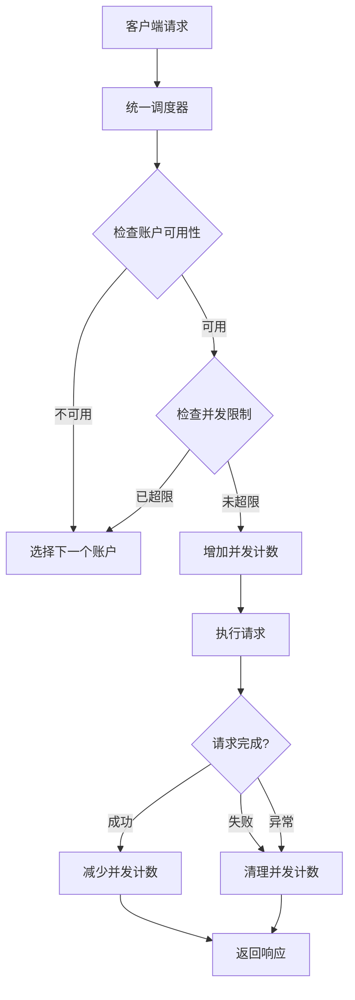

# Claude Console 账户并发限制功能

## 📚 概述

本文档详细说明 Claude Relay Service 中 **Claude Console 账户级别的并发限制功能**，包括实现原理、使用方法、配置指南和故障排查。

---

## 🎯 功能介绍

### 什么是账户并发限制？

账户并发限制是指**限制单个 Claude Console 账户同时处理的最大请求数**，防止账户因并发过高而触发限流或封禁。

### 为什么需要并发限制？

1. **防止账户封禁**：Claude Console 账户对并发有隐性限制，过高并发可能导致封号
2. **优化资源分配**：合理分配请求到多个账户，避免单账户过载
3. **提高稳定性**：降低触发 429、529 错误的概率
4. **成本控制**：配合额度管理，精细化控制每个账户的使用

### 核心特性

- ✅ **实时并发计数**：基于 Redis 的高性能并发统计
- ✅ **自动过期机制**：10分钟租期防止并发计数泄漏
- ✅ **优雅降级**：超限时自动切换到其他可用账户
- ✅ **双重清理保证**：请求结束后确保并发计数正确释放
- ✅ **可视化配置**：Web 界面直观配置并发限制

---

## 🏗️ 架构设计

### 系统流程图



### 核心组件

| 组件 | 文件路径 | 职责 |
|------|---------|------|
| **账户服务** | `src/services/claudeConsoleAccountService.js` | 并发计数管理 |
| **代理服务** | `src/services/claudeConsoleRelayService.js` | 并发检查和清理 |
| **调度器** | `src/services/unifiedClaudeScheduler.js` | 账户选择时过滤 |
| **API路由** | `src/routes/admin.js` | 接收配置参数 |
| **Web界面** | `web/admin-spa/src/components/accounts/AccountForm.vue` | 用户配置UI |

---

## 💻 代码实现详解

### 1. Redis 数据结构

#### 键命名规则

```javascript
// 并发计数键前缀
ACCOUNT_CONCURRENCY_PREFIX = 'account_concurrency:console:'

// 具体键格式
account_concurrency:console:{accountId}:{requestId}

// 示例
account_concurrency:console:12345:a7b3c4d5-e6f7-8901-2345-67890abcdef1
```

#### 数据存储方式

```javascript
// 每个请求创建一个键，值为 '1'
await client.set(requestKey, '1', 'EX', leaseSeconds)

// 并发数 = 匹配键的数量
const keys = await client.keys(`${key}:*`)
const concurrency = keys.length
```

---

### 2. 账户服务层实现

位置：`src/services/claudeConsoleAccountService.js`

#### 数据模型扩展

```javascript
// 创建账户时添加字段
{
  accountConcurrencyLimit: accountConcurrencyLimit.toString(), // 账户并发限制
  // ... 其他字段
}

// 读取账户时解析
{
  accountConcurrencyLimit: parseInt(accountData.accountConcurrencyLimit) || 0,
  // ... 其他字段
}
```

#### 核心方法一：增加并发计数

```javascript
/**
 * 增加账户并发计数
 * @param {string} accountId - 账户ID
 * @param {string} requestId - 请求唯一标识（UUID）
 * @param {number} leaseSeconds - 租期（秒），默认600秒（10分钟）
 * @returns {Promise<number>} 当前并发数
 */
async incrAccountConcurrency(accountId, requestId, leaseSeconds = 600) {
  const client = redis.getClientSafe()
  const key = `${this.ACCOUNT_CONCURRENCY_PREFIX}${accountId}`
  const requestKey = `${key}:${requestId}`

  // 设置请求标记和过期时间
  await client.set(requestKey, '1', 'EX', leaseSeconds)

  // 获取当前并发数
  const keys = await client.keys(`${key}:*`)
  return keys.length
}
```

**设计要点：**
- 使用 UUID 作为 `requestId` 确保唯一性
- 设置 `EX` 过期时间防止泄漏（即使程序崩溃也会自动清理）
- 返回当前并发数供调用方判断

#### 核心方法二：减少并发计数

```javascript
/**
 * 减少账户并发计数
 * @param {string} accountId - 账户ID
 * @param {string} requestId - 请求唯一标识
 */
async decrAccountConcurrency(accountId, requestId) {
  const client = redis.getClientSafe()
  const requestKey = `${this.ACCOUNT_CONCURRENCY_PREFIX}${accountId}:${requestId}`
  await client.del(requestKey)
}
```

#### 核心方法三：获取当前并发数

```javascript
/**
 * 获取账户当前并发数
 * @param {string} accountId - 账户ID
 * @returns {Promise<number>} 当前并发数
 */
async getAccountConcurrency(accountId) {
  const client = redis.getClientSafe()
  const key = `${this.ACCOUNT_CONCURRENCY_PREFIX}${accountId}`
  const keys = await client.keys(`${key}:*`)
  return keys.length
}
```

#### 核心方法四：刷新租期

```javascript
/**
 * 刷新账户并发租期
 * @param {string} accountId - 账户ID
 * @param {string} requestId - 请求唯一标识
 * @param {number} leaseSeconds - 租期（秒），默认600秒
 */
async refreshAccountConcurrencyLease(accountId, requestId, leaseSeconds = 600) {
  const client = redis.getClientSafe()
  const requestKey = `${this.ACCOUNT_CONCURRENCY_PREFIX}${accountId}:${requestId}`
  await client.expire(requestKey, leaseSeconds)
}
```

---

### 3. 代理服务层实现

位置：`src/services/claudeConsoleRelayService.js`

#### 完整请求处理流程

```javascript
async relayClaudeConsoleRequest(
  apiKeyData,
  accountId,
  requestBody,
  res,
  originalModel,
  effectiveModel
) {
  let abortController = null
  let account = null
  let accountRequestId = null  // 请求唯一标识
  let concurrencyDecremented = false  // 防重复清理标志

  // 📋 并发清理函数
  const cleanupConcurrency = async () => {
    if (accountRequestId && !concurrencyDecremented) {
      concurrencyDecremented = true
      await claudeConsoleAccountService
        .decrAccountConcurrency(accountId, accountRequestId)
        .catch((err) => logger.error('Failed to decrement account concurrency:', err))
    }
  }

  try {
    // 获取账户信息
    account = await claudeConsoleAccountService.getAccount(accountId)
    if (!account) {
      throw new Error('Claude Console Claude account not found')
    }

    // 🔢 检查账户并发限制
    const accountConcurrencyLimit = parseInt(account.accountConcurrencyLimit) || 0
    if (accountConcurrencyLimit > 0) {
      const { v4: uuidv4 } = require('uuid')
      accountRequestId = uuidv4()

      // 增加并发计数
      const currentConcurrency = await claudeConsoleAccountService.incrAccountConcurrency(
        accountId,
        accountRequestId,
        600 // 10分钟租期
      )

      // 检查是否超限
      if (currentConcurrency > accountConcurrencyLimit) {
        // 超过限制，立即释放
        await cleanupConcurrency()

        logger.warn(
          `🚦 Account concurrency limit exceeded: ${account.name} ` +
          `(${currentConcurrency - 1}/${accountConcurrencyLimit})`
        )

        // 返回特殊错误，让调度器重试其他账户
        const error = new Error('ACCOUNT_CONCURRENCY_EXCEEDED')
        error.accountConcurrencyExceeded = true
        error.currentConcurrency = currentConcurrency - 1
        error.concurrencyLimit = accountConcurrencyLimit
        throw error
      }

      logger.info(
        `📈 Account concurrency: ${account.name} ` +
        `(${currentConcurrency}/${accountConcurrencyLimit})`
      )
    }

    // ... 执行实际请求 ...

  } catch (error) {
    // 清理并发计数
    await cleanupConcurrency()

    // 处理特定错误
    if (error.name === 'AbortError' || error.code === 'ECONNABORTED') {
      logger.info('Request aborted due to client disconnect')
      return { aborted: true, accountId }
    }

    throw error
  } finally {
    // 确保并发计数被清理
    await cleanupConcurrency()
  }
}
```

**关键设计点：**

1. **双重清理保证**
   ```javascript
   catch { await cleanupConcurrency() }
   finally { await cleanupConcurrency() }
   ```
   - 无论成功、失败、异常都会清理
   - 防止并发计数泄漏

2. **防重复清理**
   ```javascript
   if (accountRequestId && !concurrencyDecremented) {
     concurrencyDecremented = true
     // ... 清理逻辑
   }
   ```
   - 使用标志位防止重复清理

3. **特殊错误处理**
   ```javascript
   error.accountConcurrencyExceeded = true
   error.currentConcurrency = currentConcurrency - 1
   error.concurrencyLimit = accountConcurrencyLimit
   ```
   - 让调度器识别并发超限错误
   - 自动切换到其他账户

---

### 4. 调度器集成

位置：`src/services/unifiedClaudeScheduler.js`

#### 账户可用性检查增强

```javascript
async _isAccountAvailable(accountId, accountType, model) {
  // ... 其他检查 ...

  if (accountType === 'claude_console' || accountType === 'console') {
    // ... 其他状态检查 ...

    // 🔢 检查账户并发限制
    const accountConcurrencyLimit = parseInt(account.accountConcurrencyLimit) || 0
    if (accountConcurrencyLimit > 0) {
      const currentConcurrency = await claudeConsoleAccountService.getAccountConcurrency(
        accountId
      )
      if (currentConcurrency >= accountConcurrencyLimit) {
        logger.debug(
          `⏸️ Claude Console account ${account.name} at concurrency limit ` +
          `(${currentConcurrency}/${accountConcurrencyLimit})`
        )
        return false  // 标记为不可用
      }
    }
    return true
  }
  // ... 其他账户类型 ...
}
```

**优化效果：**
- 在账户选择阶段就过滤掉已达并发上限的账户
- 避免无效的请求尝试
- 提高调度效率

#### 粘性会话并发守护（2025-10 更新）

- 位置：`src/services/unifiedClaudeScheduler.js`
- 新增 `_ensureStickyConsoleConcurrency()` 与 `_tryReuseStickyMapping()`，在复用粘性会话前：
  - 先读取账户当前并发计数
  - 若已到上限且启用守护机制，则按 `pollIntervalMs` 轮询等待，最长 `maxWaitMs`
  - 等待窗口内一旦释放并发，即继续复用原账号
  - 若等待超时仍满载，自动删除粘性映射，改用新账号，避免用户长时间阻塞
- 配套配置位于 `config/config.js` → `session.stickyConcurrency`：

```javascript
session: {
  stickyTtlHours: 1,
  renewalThresholdMinutes: 0,
  stickyConcurrency: {
    waitEnabled: process.env.STICKY_CONCURRENCY_WAIT_ENABLED !== 'false',
    maxWaitMs: parseInt(process.env.STICKY_CONCURRENCY_MAX_WAIT_MS) || 1200,
    pollIntervalMs: parseInt(process.env.STICKY_CONCURRENCY_POLL_INTERVAL_MS) || 200
  }
}
```

> 📝 建议维持默认 1.2 秒封顶等待，可根据负载情况调节：
> - 将 `waitEnabled` 设为 `false` 可直接切换账号（旧行为）
> - 增大 `maxWaitMs` 适合高并发但延迟敏感度低的业务
> - 缩短 `pollIntervalMs` 可更快捕获空闲，但会略微增加 Redis 压力

---

### 5. API 路由实现

位置：`src/routes/admin.js`

```javascript
router.post('/claude-console-accounts', authenticateAdmin, async (req, res) => {
  // ... 其他参数 ...

  const account = await claudeConsoleAccountService.createAccount({
    // ... 其他字段 ...
    accountConcurrencyLimit: req.body.accountConcurrencyLimit || 0
  })

  // ...
})
```

---

### 6. Web 界面实现

位置：`web/admin-spa/src/components/accounts/AccountForm.vue`

#### 表单字段定义

```vue
<script setup>
const form = ref({
  // ... 其他字段 ...
  accountConcurrencyLimit: props.account?.accountConcurrencyLimit || 0,
})
</script>
```

#### UI 组件（创建和编辑模式）

```vue
<template>
  <!-- 账户并发限制设置（仅Claude Console显示） -->
  <div v-if="form.platform === 'claude-console'">
    <label class="mb-3 block text-sm font-semibold text-gray-700 dark:text-gray-300">
      账户并发限制 (可选)
    </label>
    <input
      v-model.number="form.accountConcurrencyLimit"
      class="form-input w-full border-gray-300 dark:border-gray-600
             dark:bg-gray-700 dark:text-gray-200 dark:placeholder-gray-400"
      min="0"
      placeholder="0 表示无限制"
      type="number"
    />
    <p class="mt-1 text-xs text-gray-500 dark:text-gray-400">
      限制此账户同时处理的最大请求数，0 或留空表示无限制。推荐设置：3-5
    </p>
  </div>
</template>
```

#### 提交数据

```javascript
// 创建账户
const createAccount = async () => {
  if (form.value.platform === 'claude-console') {
    // ...
    data.accountConcurrencyLimit = form.value.accountConcurrencyLimit || 0
  }
  // ...
}

// 更新账户
const updateAccount = async () => {
  if (form.value.platform === 'claude-console') {
    // ...
    data.accountConcurrencyLimit = form.value.accountConcurrencyLimit || 0
  }
  // ...
}
```

---

## 📖 使用指南

### 配置步骤

1. **登录 Web 管理界面**
   ```
   http://your-domain/admin-next/
   ```

2. **创建或编辑 Claude Console 账户**
   - 导航到 "账户管理" → "Claude Console"
   - 点击 "新增账户" 或编辑现有账户

3. **设置并发限制**
   - 找到 "账户并发限制" 字段
   - 输入数字（推荐 3-5）
   - 0 或留空表示无限制

4. **保存配置**
   - 点击 "创建账户" 或 "更新账户"
   - 配置立即生效
   - 若业务需要微调粘性会话等待策略，可同步更新 `STICKY_CONCURRENCY_WAIT_ENABLED`、`STICKY_CONCURRENCY_MAX_WAIT_MS`、`STICKY_CONCURRENCY_POLL_INTERVAL_MS` 环境变量

### 推荐配置值

| 场景 | 推荐值 | 说明 |
|------|-------|------|
| **个人账户** | 3 | 适合个人使用的 Claude.ai 账户 |
| **团队账户** | 5 | 适合小团队共享账户 |
| **企业账户** | 10 | 付费企业账户，并发能力更强 |
| **测试环境** | 1 | 严格限制，避免浪费 |
| **无限制** | 0 | 不建议，可能导致封号 |

### 配置示例

#### 示例1：个人账户严格限制

```javascript
{
  "name": "Personal Account",
  "accountConcurrencyLimit": 3,
  "dailyQuota": 5.00,  // 配合额度管理
  "priority": 50
}
```

#### 示例2：多账户负载均衡

```javascript
// 账户A
{
  "name": "Team Account A",
  "accountConcurrencyLimit": 5,
  "priority": 10
}

// 账户B
{
  "name": "Team Account B",
  "accountConcurrencyLimit": 5,
  "priority": 10  // 相同优先级，自动负载均衡
}

// 账户C（备用）
{
  "name": "Backup Account",
  "accountConcurrencyLimit": 3,
  "priority": 20  // 低优先级，仅在A/B不可用时使用
}
```

#### 示例3：粘性等待相关环境变量

```bash
# 缩短粘性等待窗口，遇到并发堵塞时更快切换账号
STICKY_CONCURRENCY_WAIT_ENABLED=true
STICKY_CONCURRENCY_MAX_WAIT_MS=800
STICKY_CONCURRENCY_POLL_INTERVAL_MS=150
```

---

## 🔍 监控和调试

### 日志输出

#### 正常并发日志

```
[INFO] 📈 Account concurrency: Personal Account (2/3)
```

#### 超限警告日志

```
[WARN] 🚦 Account concurrency limit exceeded: Personal Account (3/3)
```

#### 调度器跳过日志

```
[DEBUG] ⏸️ Claude Console account Personal Account at concurrency limit (3/3)
```

### Redis 数据查看

```bash
# 连接 Redis
redis-cli

# 查看特定账户的并发请求
KEYS account_concurrency:console:12345:*

# 示例输出
1) "account_concurrency:console:12345:a7b3c4d5-e6f7-8901-2345-67890abcdef1"
2) "account_concurrency:console:12345:b8c4d5e6-f7a8-9012-3456-78901bcdef23"
3) "account_concurrency:console:12345:c9d5e6f7-a8b9-0123-4567-89012cdef345"

# 查看键的过期时间
TTL account_concurrency:console:12345:a7b3c4d5-e6f7-8901-2345-67890abcdef1
# 返回剩余秒数，如 545（还有 545 秒过期）

# 统计并发数
KEYS account_concurrency:console:12345:* | wc -l
```

### CLI 工具监控

```bash
# 查看账户状态
npm run cli accounts list

# 查看特定账户详情
npm run cli accounts test <accountId>

# 实时日志监控
npm run service:logs:follow
```

---

## ⚠️ 注意事项和限制

### 性能考虑

1. **Redis KEYS 命令性能**
   ```javascript
   const keys = await client.keys(`${key}:*`)  // 在生产环境可能较慢
   ```
   - **当前实现**：使用 `KEYS` 命令统计并发数
   - **性能影响**：在大量并发（>1000）时可能影响 Redis 性能
   - **优化方向**：可改用 Redis Sets 或 Sorted Sets

2. **推荐的优化方案（未来）**
   ```javascript
   // 使用 Set 存储活跃请求
   await client.sadd(`account_concurrency_set:${accountId}`, requestId)
   await client.expire(`account_concurrency:${accountId}:${requestId}`, 600)

   // 获取并发数
   const concurrency = await client.scard(`account_concurrency_set:${accountId}`)
   ```

### 租期设置

- **默认租期**：600 秒（10 分钟）
- **作用**：防止程序崩溃导致的并发计数泄漏
- **建议**：对于超长请求（如大文件处理），可调整租期

### 并发计数泄漏风险

**可能导致泄漏的情况：**
1. 程序崩溃且未执行 `finally` 清理
2. Redis 连接异常导致清理失败

**防御措施：**
1. ✅ 设置自动过期时间（10分钟）
2. ✅ 双重清理逻辑（catch + finally）
3. ✅ 错误捕获和日志记录

### 边界情况处理

#### 情况1：并发限制为 0

```javascript
const accountConcurrencyLimit = parseInt(account.accountConcurrencyLimit) || 0
if (accountConcurrencyLimit > 0) {
  // 只有大于 0 时才检查
}
```
- **行为**：不进行并发检查，无限制

#### 情况2：所有账户都达到并发上限

- **系统行为**：调度器找不到可用账户
- **返回错误**：`No available Claude account found`
- **建议**：合理配置多个账户，避免全部达到上限

#### 情况3：请求执行超过租期（10分钟）

- **系统行为**：Redis 自动删除键，并发计数减少
- **影响**：可能允许新请求进入（轻微超限）
- **建议**：对于超长请求场景，增加租期或实现租期续约

---

## 🐛 故障排查

### 问题1：并发计数不准确

**症状**：实际并发数与 Redis 记录不一致

**排查步骤：**

1. 检查 Redis 键
   ```bash
   redis-cli KEYS "account_concurrency:console:*"
   ```

2. 检查日志
   ```bash
   grep "Account concurrency" logs/claude-relay-*.log
   ```

3. 验证清理逻辑
   ```bash
   # 查看是否有错误日志
   grep "Failed to decrement account concurrency" logs/claude-relay-*.log
   ```

**可能原因：**
- Redis 连接异常
- 程序崩溃未清理
- 租期过期

**解决方案：**
- 重启服务（会自动清理过期键）
- 手动清理 Redis 键：`redis-cli DEL account_concurrency:console:<accountId>:*`

---

### 问题2：所有账户显示并发已满

**症状**：日志显示所有账户都达到并发上限

**排查步骤：**

1. 检查配置
   ```bash
   # 通过 API 查看账户配置
   curl -H "Authorization: Bearer <admin-token>" \
     http://localhost:3000/admin/claude-console-accounts
   ```

2. 检查实际并发
   ```bash
   redis-cli
   > KEYS account_concurrency:console:*
   > TTL account_concurrency:console:<accountId>:<requestId>
   ```

**可能原因：**
- 并发限制设置过低
- 请求处理时间过长
- 清理逻辑未正确执行

**解决方案：**
- 提高 `accountConcurrencyLimit` 值
- 检查是否有卡住的请求
- 手动清理过期的并发计数

---

### 问题3：频繁出现并发超限警告

**症状**：日志中大量 `Account concurrency limit exceeded` 警告

**排查步骤：**

1. 统计并发峰值
   ```bash
   grep "Account concurrency" logs/claude-relay-*.log | \
     awk '{print $NF}' | sort | uniq -c
   ```

2. 检查请求来源
   ```bash
   grep "Account concurrency limit exceeded" logs/claude-relay-*.log -B 5
   ```

**可能原因：**
- 并发限制设置过低
- 流量突增
- 账户数量不足

**解决方案：**
- 增加 `accountConcurrencyLimit` 值
- 添加更多 Claude Console 账户
- 配置账户分组，分散流量

---

## 📊 性能优化建议

### 当前实现的性能特点

| 操作 | 时间复杂度 | 说明 |
|------|-----------|------|
| 增加并发计数 | O(n) | `KEYS` 命令需要遍历所有键 |
| 减少并发计数 | O(1) | `DEL` 命令直接删除 |
| 获取并发数 | O(n) | `KEYS` 命令需要遍历所有键 |

### 优化方案（未来改进）

#### 方案1：使用 Redis Set

```javascript
// 创建并发集合
await client.sadd(`account_concurrency_set:${accountId}`, requestId)
await client.expire(`account_concurrency:${accountId}:${requestId}`, 600)

// 获取并发数 - O(1)
const concurrency = await client.scard(`account_concurrency_set:${accountId}`)

// 清理（需要配合 Lua 脚本自动同步）
await client.srem(`account_concurrency_set:${accountId}`, requestId)
await client.del(`account_concurrency:${accountId}:${requestId}`)
```

**优点：**
- 获取并发数 O(1) 复杂度
- 更高的性能

**缺点：**
- 需要维护两个数据结构
- 需要 Lua 脚本保证原子性

#### 方案2：使用 Redis Sorted Set + TTL

```javascript
// 使用时间戳作为 score
const now = Date.now()
await client.zadd(`account_concurrency_zset:${accountId}`, now, requestId)

// 清理过期成员 + 获取并发数
const cutoff = Date.now() - 600000  // 10分钟前
await client.zremrangebyscore(`account_concurrency_zset:${accountId}`, 0, cutoff)
const concurrency = await client.zcard(`account_concurrency_zset:${accountId}`)
```

**优点：**
- 自动清理过期数据
- 高性能查询

**缺点：**
- 清理逻辑需要在每次查询时执行

---

## 🔗 相关文档

- [并发调度机制详解](./concurrent-scheduling-mechanism.md)
- [账户管理指南](../CLAUDE.md#账户管理)
- [Redis 数据结构说明](../CLAUDE.md#redis-数据结构)

---

## 📝 总结

### 核心要点

1. **功能定位**：限制单个 Claude Console 账户的同时请求数
2. **实现方式**：基于 Redis 的租期机制 + 双重清理保证
3. **推荐配置**：个人账户 3，团队账户 5，企业账户 10
4. **自动降级**：超限时自动切换到其他可用账户
5. **防止泄漏**：10分钟自动过期 + 请求结束强制清理

### 适用场景

✅ **推荐使用：**
- 个人 Claude.ai 账户（防封号）
- 多用户共享账户（公平分配）
- 付费账户成本控制
- 测试环境严格限制

❌ **不推荐使用：**
- 官方 API 账户（已有自己的限流）
- 单用户专用账户且并发很低
- 高性能要求场景（当前 KEYS 实现有性能开销）

### 未来改进方向

1. ✨ 优化 Redis 数据结构（使用 Set/Sorted Set）
2. ✨ 支持动态调整并发限制
3. ✨ 增加并发使用率统计和可视化
4. ✨ 支持租期自动续约（超长请求）
5. ✨ 支持基于时间段的并发限制

---

**最后更新**：2025-10-10
**维护者**：Claude Relay Service Team
**Git Commit**：待提交（feat: 为Claude Console账户添加并发限制功能）
