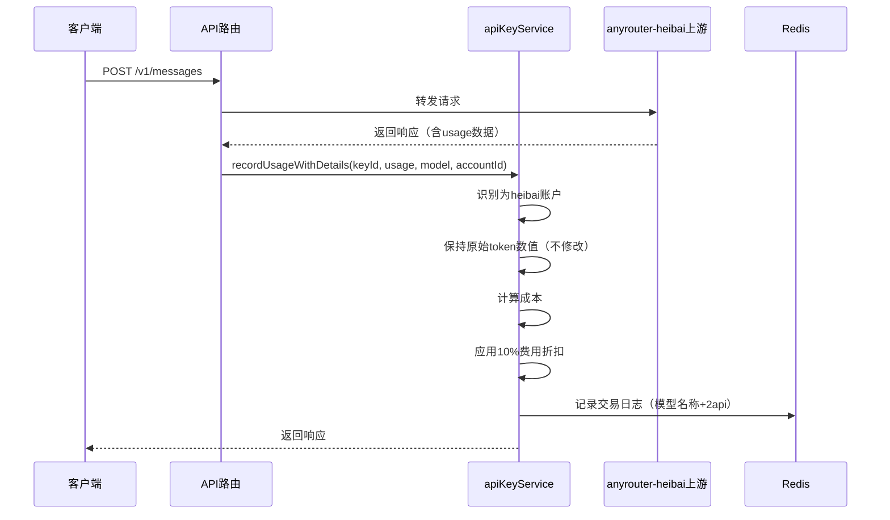

# anyrouter-heibai 账户简化计费策略

## 概述

anyrouter-heibai 账户采用简化的计费策略，不再进行 token 重新分配和会话追踪，直接使用上游返回的原始数据，并应用特殊的费用折扣。

## 核心策略

### 1. 保持原始 Token 数值

anyrouter-heibai 账户不再修改上游返回的 token 数值，直接使用：

- `input_tokens` - 原始输入 tokens
- `cache_creation_input_tokens` - 原始缓存创建 tokens
- `cache_read_input_tokens` - 原始缓存读取 tokens
- `output_tokens` - 原始输出 tokens

### 2. 30% 费用折扣（70% 折扣）

anyrouter-heibai 账户的用户只需支付 **30%** 的费用（享受 **70% 折扣**）：

```javascript
anyrouterDiscountRatio = 0.3 // 用户支付 30% 费用
```

费用折扣应用到所有成本组成部分：

- `totalCost` - 总成本
- `ephemeral5mCost` - 5分钟临时缓存成本
- `ephemeral1hCost` - 1小时临时缓存成本

### 3. 模型名称后缀标识

在交易日志中，anyrouter-heibai 账户的请求会在模型名称后添加 `2api` 后缀，便于识别：

**示例**：

- 原始模型：`claude-haiku-4-5-20251001`
- 日志显示：`claude-haiku-4-5-20251001-2api`

## 修改的文件

1. **[src/services/apiKeyService.js](../src/services/apiKeyService.js:1161-1169)** - 简化的 heibai 账户处理逻辑
2. **[src/services/apiKeyService.js](../src/services/apiKeyService.js:1270)** - 费用折扣注释更新
3. **[src/services/apiKeyService.js](../src/services/apiKeyService.js:1046-1068)** - 交易日志模型名称后缀
4. **[src/services/apiKeyService.js](../src/services/apiKeyService.js:1418-1429)** - 交易日志模型名称后缀

## 详细代码变更

### 1. 简化的 heibai 账户识别和折扣设置

**修改位置**：[src/services/apiKeyService.js](../src/services/apiKeyService.js:1161-1169)

```javascript
// 🎯 步骤1：anyrouter-heibai 账户特殊处理（保持原始token数值，应用30%费用折扣）
if (isHeibaiAccount) {
  isAnyRouterAccount = true // 标记为anyrouter账户
  anyrouterDiscountRatio = 0.3 // heibai账户按30%计费（70%折扣）

  logger.info(
    `💰 [anyrouter-heibai特殊计费] 账户"${account.name}"保持原始token数值: input=${inputTokens}, cache_create=${cacheCreateTokens}, cache_read=${cacheReadTokens}, 用户支付30%费用（70%折扣）`
  )
}
```

### 2. 费用折扣应用

**修改位置**：[src/services/apiKeyService.js](../src/services/apiKeyService.js:1267-1282)

```javascript
// 💸 anyrouter账户特殊折扣：在Token转换优化后应用费用折扣
if (isAnyRouterAccount && costInfo.totalCost > 0) {
  const originalCost = costInfo.totalCost
  // 使用账户特定的折扣率（heibai: 30%, anyrouter: 50%）
  const discountRatio = anyrouterDiscountRatio

  // 应用折扣到所有费用组成部分
  costInfo.totalCost = costInfo.totalCost * discountRatio
  costInfo.ephemeral5mCost = (costInfo.ephemeral5mCost || 0) * discountRatio
  costInfo.ephemeral1hCost = (costInfo.ephemeral1hCost || 0) * discountRatio

  const discountPercent = Math.round((1 - discountRatio) * 100)
  logger.info(
    `💸 [anyrouter优化计费-步骤2] 应用${discountPercent}%费用折扣(保留${Math.round(discountRatio * 100)}%): $${originalCost.toFixed(6)} → $${costInfo.totalCost.toFixed(6)} (节省 $${(originalCost - costInfo.totalCost).toFixed(6)})`
  )
}
```

### 3. 交易日志模型名称后缀

**修改位置1**：[src/services/apiKeyService.js](../src/services/apiKeyService.js:1046-1068)

```javascript
// 📝 记录交易日志（用于前端查询）- 使用消费后的实际余额
try {
  // 🎯 为 heibai 账户添加 2api 后缀标识
  const logModel = isHeibaiAccount ? `${model}2api` : model

  const transactionLogData = {
    model: logModel,
    inputTokens,
    outputTokens,
    cacheCreateTokens,
    cacheReadTokens,
    cost: costInfo.costs.total || 0,
    remainingQuota: remainingQuotaAfterCharge
  }
  // ...
}
```

**修改位置2**：[src/services/apiKeyService.js](../src/services/apiKeyService.js:1418-1429)

```javascript
// 📝 记录交易日志（用于前端查询）- 使用消费后的实际余额
try {
  // 🎯 为 heibai 账户添加 2api 后缀标识
  const logModel = isHeibaiAccount ? `${model}2api` : model

  await redis.addTransactionLog(keyId, {
    model: logModel,
    inputTokens,
    outputTokens,
    cacheCreateTokens,
    cacheReadTokens,
    cost: costInfo.totalCost || 0,
    remainingQuota: remainingQuotaAfterCharge
  })
}
```

## 工作流程



## 测试方法

### 1. 使用测试脚本

运行测试脚本查看原始响应数据：

```bash
node scripts/test-anyrouter-heibai.js
```

**注意**：需要先在脚本中配置实际的 API URL 和 API Key。

### 2. 查看日志

修改后的代码会输出以下日志：

```
💰 [anyrouter-heibai特殊计费] 账户"anyrouter-heibai-xxx"保持原始token数值:
   input=28524, cache_create=10193, cache_read=72632, 用户支付30%费用（70%折扣）

💸 [anyrouter优化计费-步骤2] 应用70%费用折扣(保留30%):
   $0.5000 → $0.1500 (节省 $0.3500)
```

### 3. 检查交易日志

修正后，交易日志中应该显示：

| 时间     | 模型       | 输入   | 输出 | 缓存创建 | 缓存读取 | 费用    | 说明                     |
| -------- | ---------- | ------ | ---- | -------- | -------- | ------- | ------------------------ |
| 14:00:00 | haiku-2api | 28,524 | 225  | 10,193   | 72,632   | $0.1500 | 保持原始数据，30%计费 ✅ |
| 14:00:30 | haiku-2api | 15,200 | 180  | 5,800    | 42,000   | $0.0960 | 保持原始数据，30%计费 ✅ |

## 数据示例

### 上游返回的原始数据

```json
{
  "usage": {
    "input_tokens": 28524,
    "output_tokens": 225,
    "cache_creation_input_tokens": 10193,
    "cache_read_input_tokens": 72632
  }
}
```

### 系统处理后

**Token 数值**：完全保持不变

- input_tokens: `28524` （无修改）
- cache_creation_input_tokens: `10193` （无修改）
- cache_read_input_tokens: `72632` （无修改）
- output_tokens: `225` （无修改）

**费用计算**：

- 原始成本：`$0.5000`
- 折扣后成本：`$0.1500`（30% 计费）
- 节省：`$0.3500`（70% 折扣）

**交易日志**：

- 模型名称：`claude-haiku-4-5-20251001-2api`（添加后缀）
- 其他字段：保持原始数值

## 相关文件

- 主要修改：[src/services/apiKeyService.js](../src/services/apiKeyService.js)
- 测试脚本：[scripts/test-anyrouter-heibai.js](../scripts/test-anyrouter-heibai.js)

## 注意事项

1. **只影响 anyrouter-heibai 账户**：此策略仅对账户名包含 `anyrouter-heibai` 的账户生效
2. **不修改 token 数值**：完全保持上游返回的原始数据
3. **30% 费用计费**：用户享受 70% 折扣，只支付原价的 30%
4. **模型名称后缀**：交易日志中自动添加 `-2api` 后缀，便于识别
5. **向后兼容**：如果上游修复了数据问题，此代码仍然能正常工作

## 对比旧版本

### 旧版本（v2.0）

- ❌ 复杂的会话追踪逻辑（Redis 会话记录）
- ❌ Token 重新分配策略（修改原始数据）
- ❌ 区分新会话和后续请求
- ✅ 20% 费用计费（80% 折扣）

### 新版本（v4.0）

- ✅ 无会话追踪（简化逻辑）
- ✅ 保持原始 token 数值（不修改）
- ✅ 统一处理所有请求
- ✅ **30% 费用计费（70% 折扣）**
- ✅ 模型名称自动添加 `-2api` 后缀

## 折扣参数修改清单

### 需要修改的参数位置（v4.0）

所有折扣参数已统一调整为 **0.3**（用户支付 30% 费用，享受 70% 折扣）：

#### 1. 流式 API 折扣参数
**文件**: [src/services/apiKeyService.js](../src/services/apiKeyService.js#L940)
**位置**: 第 940 行
```javascript
const discountRatio = 0.3 // heibai账户按30%计费（70%折扣）
```

#### 2. 非流式 API 折扣参数
**文件**: [src/services/apiKeyService.js](../src/services/apiKeyService.js#L1191)
**位置**: 第 1191 行
```javascript
anyrouterDiscountRatio = 0.3 // heibai账户按30%计费（70%折扣）
```

#### 3. 相关日志信息更新
- **第 950 行**: 日志显示 "应用70%折扣"
- **第 1194 行**: 日志显示 "用户支付30%费用（70%折扣）"

### 折扣对照表

| 设置值 | 用户实际支付 | 折扣力度 | 效果 | 状态 |
|--------|-------------|---------|------|------|
| 0.2 | 20% 费用 | 80% 折扣 | 扣费少 ⬇️ | v3.0 旧版 |
| **0.3** | **30% 费用** | **70% 折扣** | **当前设置** | **v4.0 ✅** |
| 0.4 | 40% 费用 | 60% 折扣 | 扣费多 ⬆️ | 未使用 |
| 0.5 | 50% 费用 | 50% 折扣 | 半价 | 未使用 |

## 更新日志

- **2025-11-18 v4.0**: 调整折扣率从 20% 提升至 30%（用户支付 30% 费用，享受 70% 折扣）
- **2025-11-16 v3.0**: 简化策略，移除会话追踪和 token 重新分配，改为 20% 费用计费，添加模型名称后缀
- **2025-11-14 v2.0**: 新增基于会话的智能缓存分配，解决新会话缓存分配不合理的问题
- **2025-11-14 v1.0**: 初始版本，修复 anyrouter-heibai 账户首次请求异常包含 cache_read 的问题
