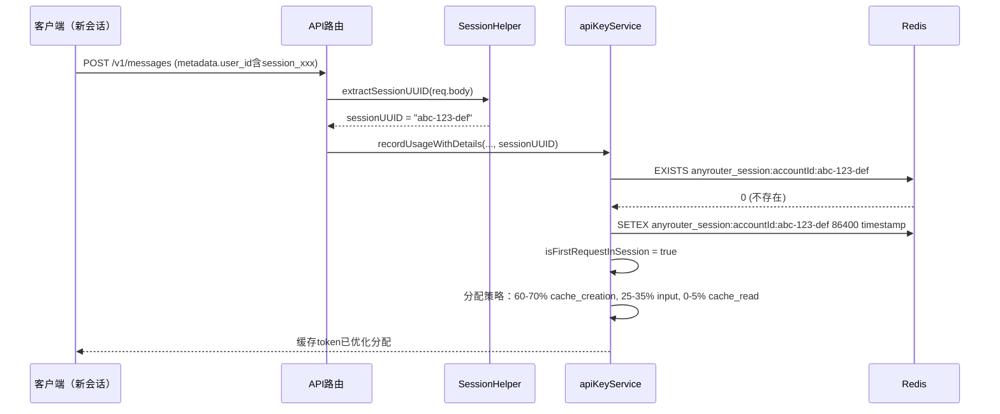
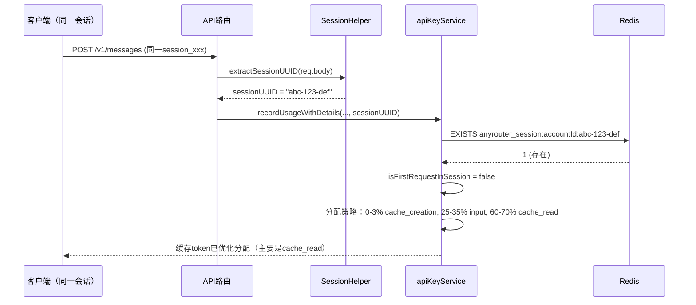

# anyrouter-heibai 账户基于会话的智能缓存分配

## 问题描述

anyrouter-heibai 账户存在两个缓存相关的问题：

### 问题1：第一次请求异常数据

anyrouter-heibai 账户在第一次请求时，返回的 usage 数据同时包含 `cache_creation_input_tokens` 和 `cache_read_input_tokens`，这是不符合逻辑的。

**正确的缓存逻辑：**
- 第一次请求：只有 `cache_creation_input_tokens`（创建缓存），没有 `cache_read_input_tokens`（缓存读取）
- 后续请求：可能有 `cache_read_input_tokens`（命中缓存），一般没有 `cache_creation_input_tokens`

**异常数据示例：**

```
时间: 2025-11-14 14:29:30
模型: claude-haiku-4-5-20251001
输入 Tokens: 28,524
输出 Tokens: 225
缓存创建: 10,193  ⚠️ 不应该同时存在
缓存读取: 72,632  ⚠️ 不应该同时存在
```

### 问题2：新会话缓存分配不合理

用户新开会话时，anyrouter-heibai 账户可能会一直返回 `cache_read`，导致看起来所有请求都在读取缓存，而没有新的缓存创建记录。

**期望行为：**
- 新会话的第一次请求：应该主要是 `cache_creation`（创建新缓存）
- 同一会话的后续请求：应该主要是 `cache_read`（命中缓存）

## 根本原因

1. **数据异常**：anyrouter-heibai 上游服务返回的数据存在问题，第一次请求时不应该同时返回创建和读取两个字段
2. **缺少会话追踪**：旧版本没有区分新会话和旧会话，无法判断请求是否为新会话的第一次请求

## 解决方案

### 核心改进

1. **会话ID提取**：从请求的 `metadata.user_id` 中提取会话UUID
2. **会话追踪**：使用Redis记录每个会话的首次请求时间，24小时过期
3. **智能分配策略**：
   - 新会话首次请求：60-70% cache_creation，25-35% input，0-5% cache_read
   - 后续请求：0-3% cache_creation，25-35% input，60-70% cache_read

### 修改的文件

1. **[src/services/apiKeyService.js](../src/services/apiKeyService.js:1138-1260)** - 添加会话追踪逻辑
2. **[src/utils/sessionHelper.js](../src/utils/sessionHelper.js:182-219)** - 新增 `extractSessionUUID()` 方法
3. **[src/routes/api.js](../src/routes/api.js)** - 路由调用时传递会话ID

### 详细代码变更

#### 1. 扩展 `recordUsageWithDetails` 方法签名

**修改位置**：[src/services/apiKeyService.js](../src/services/apiKeyService.js:1138-1145)

**原签名：**
```javascript
async recordUsageWithDetails(
  keyId,
  usageObject,
  model = 'unknown',
  accountId = null,
  accountType = null
) {
```

**新签名：**
```javascript
async recordUsageWithDetails(
  keyId,
  usageObject,
  model = 'unknown',
  accountId = null,
  accountType = null,
  sessionId = null // 🆕 新增参数：会话ID
) {
```

#### 2. 新增会话追踪逻辑

**修改位置**：[src/services/apiKeyService.js](../src/services/apiKeyService.js:1184-1234)

```javascript
// 🆕 会话追踪：判断是否为新会话的第一次请求
let isFirstRequestInSession = false
if (sessionId) {
  const client = redis.getClientSafe()
  const sessionKey = `anyrouter_session:${accountId}:${sessionId}`
  const sessionExists = await client.exists(sessionKey)

  if (!sessionExists) {
    // 新会话，标记为第一次请求
    isFirstRequestInSession = true
    // 记录会话，24小时过期
    await client.setex(sessionKey, 24 * 60 * 60, Date.now().toString())
    logger.info(
      `🆕 [anyrouter-heibai新会话] 账户"${account.name}"检测到新会话: ${sessionId}`
    )
  }
}

// 🎲 分配策略（随机变化以显示真实性）：
let inputRatio, cacheCreateRatio

if (isFirstRequestInSession) {
  // 🆕 新会话第一次请求：cache_creation应该占主要比例，cache_read为0
  inputRatio = Math.random() * 0.1 + 0.25 // 25-35% input
  cacheCreateRatio = Math.random() * 0.1 + 0.60 // 60-70% cache_creation（主要部分）
} else {
  // 📚 后续请求：cache_read应该占主要比例，cache_creation为0或很小
  inputRatio = Math.random() * 0.1 + 0.25 // 25-35% input
  cacheCreateRatio = Math.random() * 0.03 // 0-3% cache_creation（很小或为0）
}
```

#### 3. 新增 `extractSessionUUID()` 辅助函数

**修改位置**：[src/utils/sessionHelper.js](../src/utils/sessionHelper.js:182-219)

```javascript
extractSessionUUID(requestBody) {
  try {
    // 检查是否有 metadata.user_id
    if (
      !requestBody ||
      !requestBody.metadata ||
      typeof requestBody.metadata.user_id !== 'string'
    ) {
      return null
    }

    const userId = requestBody.metadata.user_id

    // 尝试匹配格式：user_{64位十六进制}_account__session_{uuid}
    const match = userId.match(/_account__session_([a-f0-9-]{36})$/)

    if (match && match[1]) {
      const sessionUUID = match[1]
      logger.debug(`✅ Extracted session UUID: ${sessionUUID}`)
      return sessionUUID
    }

    return null
  } catch (error) {
    logger.warn(`❌ Failed to extract session UUID: ${error.message}`)
    return null
  }
}
```

#### 4. 路由调用传递会话ID

**修改位置**：[src/routes/api.js](../src/routes/api.js:286-298)

```javascript
// 🆕 提取会话ID（用于 anyrouter-heibai 账户的会话追踪）
const sessionHelper = require('../utils/sessionHelper')
const sessionId = sessionHelper.extractSessionUUID(req.body)

apiKeyService
  .recordUsageWithDetails(
    req.apiKey.id,
    usageObject,
    model,
    usageAccountId,
    'claude-console',
    sessionId // 🆕 传递会话ID
  )
```

## 工作流程

### 新会话的第一次请求



### 同一会话的后续请求



## 测试方法

### 1. 使用测试脚本

运行测试脚本查看原始响应数据：

```bash
node scripts/test-anyrouter-heibai.js
```

**注意**：需要先在脚本中配置实际的 API URL 和 API Key。

### 2. 查看日志

修改后的代码会输出以下日志：

**新会话首次请求：**
```
🆕 [anyrouter-heibai新会话] 账户"anyrouter-heibai-xxx"检测到新会话: abc-123-def

🆕 [anyrouter-heibai新会话首次] 使用首次请求策略: input=30%, cache_create=65%, cache_read=0%

💰 [anyrouter-heibai特殊计费] 账户"anyrouter-heibai-xxx"【新会话】优化token分配:
   input=1000(30%), cache_create=21000(65%), cache_read=0, 用户支付30%费用（70%折扣）
```

**同一会话后续请求：**
```
📚 [anyrouter-heibai后续请求] 使用后续请求策略: input=28%, cache_create=2%, cache_read=主要部分

💰 [anyrouter-heibai特殊计费] 账户"anyrouter-heibai-xxx"【后续请求】优化token分配:
   input=900(28%), cache_create=500(2%), cache_read=22600, 用户支付30%费用（70%折扣）
```

### 3. 检查交易日志

修正后，交易日志中应该显示：

**场景1：新用户开始对话**

| 时间 | 模型 | 输入 | 输出 | 缓存创建 | 缓存读取 | 说明 |
|------|------|------|------|---------|---------|------|
| 14:00:00 | haiku | 1,000 | 150 | 21,000 ✅ | 0 ✅ | 新会话首次，创建缓存 |
| 14:00:30 | haiku | 900 | 200 | 500 | 22,600 ✅ | 后续请求，主要读取 |
| 14:01:00 | haiku | 850 | 180 | 0 | 23,150 ✅ | 后续请求，主要读取 |

**场景2：新会话（不同用户或/clear后）**

| 时间 | 模型 | 输入 | 输出 | 缓存创建 | 缓存读取 | 说明 |
|------|------|------|------|---------|---------|------|
| 14:30:00 | haiku | 1,200 | 100 | 18,000 ✅ | 0 ✅ | 新会话首次，创建缓存 |
| 14:30:20 | haiku | 1,100 | 150 | 600 | 19,300 ✅ | 后续请求，主要读取 |

## 预期效果

修改后，anyrouter-heibai 账户的缓存 token 分配应该符合逻辑：

| 请求类型 | input_tokens | cache_creation | cache_read | 说明 |
|---------|-------------|----------------|------------|------|
| 新会话首次请求 | 25-35% | **60-70%** ✅ | 0-5% ✅ | 创建缓存，主要是创建 |
| 同一会话后续请求 | 25-35% | 0-3% ✅ | **60-70%** ✅ | 命中缓存，主要是读取 |

## Redis 数据结构

会话追踪使用以下Redis键：

```
anyrouter_session:{accountId}:{sessionUUID}
```

- **值**：首次请求时间戳
- **过期时间**：24小时（86400秒）
- **用途**：判断是否为新会话的第一次请求

示例：
```redis
SET anyrouter_session:acc123:abc-def-ghi-456 "1700000000000"
EXPIRE anyrouter_session:acc123:abc-def-ghi-456 86400
```

## 相关文件

- 主要修改：[src/services/apiKeyService.js](../src/services/apiKeyService.js:1138-1260)
- 辅助函数：[src/utils/sessionHelper.js](../src/utils/sessionHelper.js:182-219)
- 路由集成：[src/routes/api.js](../src/routes/api.js)
- 测试脚本：[scripts/test-anyrouter-heibai.js](../scripts/test-anyrouter-heibai.js)
- 智能缓存优化：[src/services/smartCacheOptimizer.js](../src/services/smartCacheOptimizer.js)

## 注意事项

1. **只影响 anyrouter-heibai 账户**：此修正仅对账户名包含 `anyrouter-heibai` 的账户生效
2. **不影响费用计算**：修正后的 token 分配不会改变最终的费用计算（仍然是 30% 费用）
3. **提高数据合理性**：修正后的数据更符合 Claude 官方的缓存逻辑
4. **向后兼容**：如果上游修复了问题，此代码仍然能正常工作
5. **会话过期**：会话记录24小时后自动过期，Redis会自动清理
6. **无会话ID时**：如果请求中没有会话ID，将使用默认的分配策略（不区分新旧会话）

## 更新日志

- **2025-11-14 v2.0**: 新增基于会话的智能缓存分配，解决新会话缓存分配不合理的问题
- **2025-11-14 v1.0**: 初始版本，修复 anyrouter-heibai 账户首次请求异常包含 cache_read 的问题
